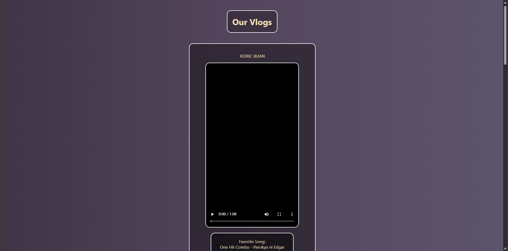
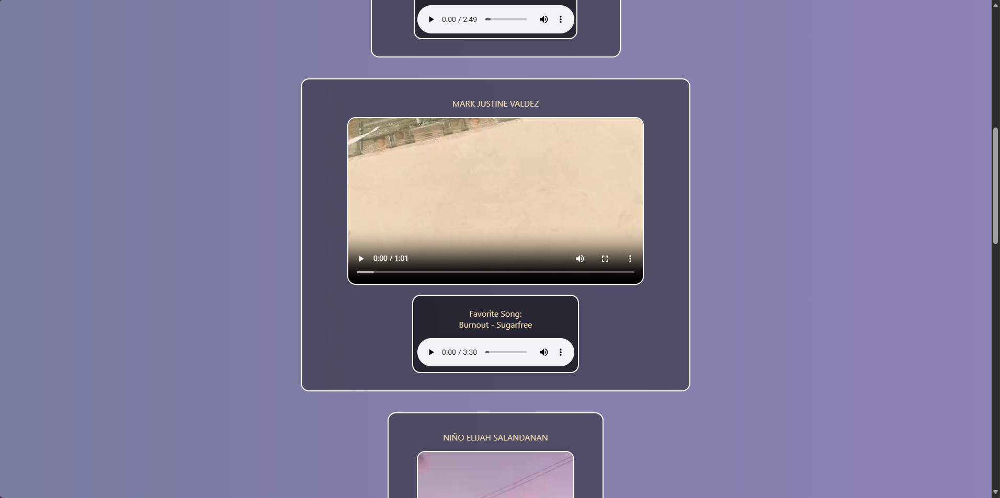

# 📹 COMPUTER PROGRAMMING Activity - Vlog

This repository contains our group activity for **COMPUTER PROGRAMMING - HTML**.  
You can view the live project here: 👉 [**Visit Project**](https://carldv.github.io/for-vlog/)

---

## 👥 Group Members
- Jedric Buan  
- Nino Elijah Salandanan  
- Joren Jacob  
- Mark Justine Valdez  
- David Carl Luto  

---

## 🎥 Features
- Individual vlog clips displayed in a clean card layout  
- Favorite song section with audio playback for each member  
- Animated gradient background for a dynamic look  

---

## 🖼️ Preview

---

## 🌐 Deployment
The project is hosted using **GitHub Pages**:  
[https://carldv.github.io/for-vlog/](https://carldv.github.io/for-vlog/)
